# Antigravity LSP Enforcement Kit

[](https://github.com/dbqp01/LSP-Antigravity-CLI/actions) [](LICENSE) [](https://antigravity.dev) [](src/lsp_audit.py)

Plugin de extension para Google Antigravity CLI (`agy`) que provee integracion con Language Server Protocol (LSP 3.17) mediante un servidor MCP nativo y un conjunto de hooks para el ciclo de vida del agente.

---

## 1. Descripcion Tecnica

El sistema opera sobre cuatro eventos del ciclo de vida de Antigravity CLI (`hooks.json`):

1. **PreToolUse (`src/nav_guard.py`)**: Intercepta llamadas a `grep_search`, `find_by_name` y comandos de busqueda en `run_command`. Si el parametro coincide con nombres de simbolos de codigo (`PascalCase`, `camelCase`, `snake_case`, accesos a propiedades), deniega la ejecucion (`decision: "deny"`) y retorna la sugerencia de la herramienta MCP correspondiente.
2. **PostToolUse (`src/lsp_audit.py post-tool`)**: Se ejecuta tras llamadas a `write_to_file` y `replace_file_content`. Realiza analisis sintactico y de tipos del archivo modificado mediante parsers AST y linters configurados. Los diagnosticos se registran en `.agents/.audit_cache/<conversation_id>.json`.
3. **PreInvocation (`src/lsp_audit.py pre-invocation`)**: Lee la cache de la sesion actual antes de cada invocacion del modelo. Si existen errores pendientes, inyecta un mensaje efimero (`ephemeralMessage`) con archivo, linea y descripcion del diagnostico.
4. **Stop (`src/lsp_audit.py stop`)**: Calidad de salida. Si existen errores en cache al intentar finalizar la ejecucion, retorna `decision: "continue"` para requerir la correccion. Dispone de un limite de 3 intentos consecutivos antes de permitir la finalizacion.

```mermaid
flowchart TD
    subgraph PreToolUse [1. Intercepcion de Busqueda]
        A[Llamada a grep_search / find_by_name / run_command] --> B(src/nav_guard.py)
        B --> C{Coincide con simbolo de codigo?}
        C -- Si --> D[decision: deny + Sugiere herramienta MCP]
        C -- No --> E[decision: allow]
    end

    subgraph PostToolUse [2. Auditoria Post-Escritura]
        F[Escritura via write_to_file / replace_file_content] --> G(src/lsp_audit.py post-tool)
        G --> H[Ejecucion de AST / Linters por archivo]
        H --> I[Actualizacion de .agents/.audit_cache/conv_id.json]
    end

    subgraph PreInvocation [3. Inyeccion de Diagnostico]
        J(src/lsp_audit.py pre-invocation) --> K{Errores en cache?}
        K -- Si --> L[Inyecta ephemeralMessage con diagnostico]
        K -- No --> M[Sin inyeccion]
    end

    subgraph Stop [4. Control de Finalizacion]
        N(src/lsp_audit.py stop) --> O{Errores en cache?}
        O -- No --> P[decision: allow]
        O -- Si --> Q{Intentos <= 3}
        Q -- Si --> R[decision: continue]
        Q -- No --> S[decision: allow - Limite alcanzado]
    end
```



---

## 2. Servidor MCP y Herramientas Expuestas

El plugin implementa un servidor MCP sobre stdio (`src/mcp_server.py`) que gestiona clientes LSP locales (`src/lsp_client.py`) y orquesta los procesos de servidores de lenguaje (`src/lsp_manager.py`).

| Herramienta | Parametros | Descripcion |
| :--- | :--- | :--- |
| `find_definition` | `filepath` (string), `line` (int), `character` (int) | Retorna ubicacion de la definicion del simbolo segun el language server. |
| `find_references` | `filepath` (string), `line` (int), `character` (int) | Retorna lista de referencias y llamadas al simbolo en el proyecto. |
| `search_workspace_symbols` | `query` (string) | Busca declaraciones de clases, funciones e interfaces en el indice del workspace. |
| `get_document_outline` | `filepath` (string) | Retorna arbol de simbolos del archivo (clases, metodos, funciones). |
| `get_diagnostics` | `filepath` (string) | Retorna lista de diagnosticos, advertencias y errores del compilador. |

---

## 3. Soporte de Lenguajes y Motores de Analisis

| Lenguaje | Extensiones | Motor Primario | Fallback / Verificador |
| :--- | :--- | :--- | :--- |
| **Python** | `.py`, `.pyi` | `ast.parse()` + `symtable` (stdlib) | `ruff`, `pyright`, `basedpyright` |
| **TypeScript / JS** | `.ts`, `.tsx`, `.js`, `.jsx`, `.mjs`, `.cjs` | `node --check` (JS) | `biome`, `tsc --noEmit` (nearest root) |
| **Astro** | `.astro` | Parser de frontmatter (`---`) | `@astrojs/check` |
| **PHP** | `.php` | `php -l` | Intelephense via LSP |
| **Rust** | `.rs` | `cargo check --message-format=json` | `rust-analyzer` via LSP |
| **Go** | `.go` | `go vet` | `gopls` via LSP |
| **Shell** | `.sh`, `.bash`, `.zsh` | `bash -n` / `sh -n` | `bash-language-server` |
| **PowerShell** | `.ps1`, `.psm1`, `.psd1` | `System.Management.Automation.Language.Parser` | AST de PowerShell |
| **JSON / TOML** | `.json`, `.toml` | `json.loads()`, `tomllib.loads()` (stdlib) | N/A |

---

## 4. Estructura de Directorios

```text
config_de_agy/
|-- plugin.json              # Manifiesto del plugin para Antigravity CLI
|-- hooks.json               # Definicion de hooks del ciclo de vida
|-- mcp_config.json          # Configuracion de ejecucion del servidor MCP
|-- rules/
|   `-- AGENTS.md            # Regla de contexto para priorizar herramientas LSP
|-- skills/
|   `-- lsp-diagnostics/
|       `-- SKILL.md         # Definicion de skill para ejecucion de diagnosticos
|-- src/                     # Motor de ejecucion (Python stdlib)
|   |-- nav_guard.py         # Interceptor de busquedas y comandos de terminal
|   |-- lsp_audit.py         # Auditor de sintaxis, cache y control de stop
|   |-- lsp_client.py        # Implementacion de cliente JSON-RPC 2.0 (LSP 3.17)
|   |-- lsp_manager.py       # Aprovisionamiento y ruteo de procesos LSP
|   `-- mcp_server.py        # Protocolo MCP sobre stdio
|-- docs/                    # Documentacion del proyecto
|   |-- ARCHITECTURE.md      # Especificacion de diseno y mitigacion en monorepos
|   |-- AUDIT_SUMMARY.md     # Resultados de pruebas de auditoria y sandbox
|   |-- CHANGELOG.md         # Registro de cambios por version
|   `-- MARKETPLACE_GUIDE.md # Instrucciones de instalacion y publicacion
|-- tests/                   # Suite de pruebas automatizadas
|   |-- test_audit_engine.py
|   |-- test_hooks_e2e.py
|   |-- test_lsp_architecture.py
|   |-- test_nav_guard.py
|   |-- stress_test_suite.py
|   |-- simulate_task.py
|   `-- synthetic_class_error_demo.py
|-- docker/                  # Entorno Docker para ejecucion de pruebas
|   |-- Dockerfile
|   `-- docker-compose.yml
|-- install.ps1 / .sh / .cmd # Scripts de instalacion en workspace o global
|-- README.md                # Documentacion principal
`-- LICENSE                  # Licencia MIT
```

---

## 5. Instalacion

### Via Antigravity CLI (`agy`)

```bash
# Instalacion desde repositorio remoto
agy plugin install https://github.com/dbqp01/LSP-Antigravity-CLI

# Instalacion desde directorio local
agy plugin install .
```

### Via Scripts del Repositorio

#### Windows
```powershell
# PowerShell
.\install.ps1

# CMD
install.cmd
```

#### Linux / macOS
```bash
chmod +x install.sh
./install.sh
```

---

## 6. Verificacion y Pruebas

### Diagnostico de Herramientas Instaladas
```bash
python src/lsp_audit.py status
```

### Validacion del Manifiesto del Plugin
```bash
agy plugin validate .
```

### Ejecucion de la Suite de Pruebas Unitaria
```bash
python -m unittest discover tests -v
```

### Ejecucion de Pruebas de Estres y Rendimiento
```bash
python tests/stress_test_suite.py
```

### Ejecucion en Sandbox Docker
```bash
docker compose -f docker/docker-compose.yml run --rm audit-sandbox
```

---

## 7. Administracion del Plugin

```bash
# Listar plugins registrados
agy plugin list

# Habilitar plugin
agy plugin enable lsp-enforcement-kit

# Deshabilitar plugin
agy plugin disable lsp-enforcement-kit

# Desinstalar plugin
agy plugin uninstall lsp-enforcement-kit
```

---

## 8. Atribucion

Adaptacion para Google Antigravity basada en la arquitectura de [claude-code-lsp-enforcement-kit](https://github.com/nesaminua/claude-code-lsp-enforcement-kit) por [@nesaminua](https://github.com/nesaminua), bajo Licencia MIT.

---

## 9. Licencia

Licencia MIT. Consultar [LICENSE](LICENSE) para el texto completo de la licencia.
