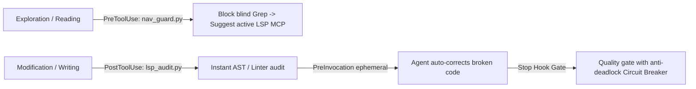

# Antigravity LSP Enforcement Kit

> A 360-degree Closed-Loop LSP Lifecycle & Quality Gate for Antigravity CLI
> Enforce LSP-first navigation to save up to 80% tokens & prevent broken code from landing.

[](https://github.com/your-username/antigravity-lsp-enforcement-kit/actions)
[](LICENSE)
[](https://antigravity.dev)
[](plugin/lsp-enforcement-kit/lsp_audit.py)

---

## 1. The Problem

Without semantic LSP guidance, AI coding agents suffer from two critical inefficiencies:

1. Blind Exploration (Token Waste): The agent searches symbols via full-workspace grep_search and reads entire files, consuming 5,000-10,000+ tokens per lookup.
2. Blind Modification (Broken Code): The agent edits code without immediate syntax or type validation, finishing tasks with unresolved compilation errors.

---

## 2. The Solution: 360-degree LSP Lifecycle



### Supported Languages & Tools:
* **Python** (`.py`): AST (0ms) + Native `symtable` (catches undefined variables / NameErrors) + `ruff` + `pyright`.
* **TypeScript / JavaScript** (`.ts`, `.tsx`, `.js`, `.jsx`, `.mjs`, `.cjs`): `node --check` + `biome` + `tsc`.
* **Astro** (`.astro`): Frontmatter validation + `@astrojs/check`.
* **PHP** (`.php`): Native static lint parsing via `php -l`.
* **PowerShell** (`.ps1`, `.psm1`, `.psd1`): Native .NET AST Parser (`System.Management.Automation.Language.Parser`).
* **Bash / Shell** (`.sh`, `.bash`, `.zsh`): Cold static syntax checking via `bash -n` / `sh -n`.
* **Rust** (`.rs`): `cargo check --message-format=json`.
* **Go** (`.go`): `go vet`.
* **JSON / TOML** (`.json`, `.toml`): Native standard library parsers.

---

## 3. Quick 1-Click Installation

### Windows (PowerShell / CMD)
```powershell
# PowerShell
.\install.ps1

# CMD (or double-click)
install.cmd
```

### Linux & macOS (Bash)
```bash
chmod +x install.sh
./install.sh
```

---

## 4. Diagnostic Status Check

Verify installed compilers, linters, and session cache state at any time:

```bash
python .agents/hooks/lsp_audit.py status
```

---

## 5. Testing & Reproducibility

### Run the Native Test Suite (16 tests, 0 dependencies)
```bash
python -m unittest discover tests -v
```

### Run Stress & Benchmarking Suite
```bash
python tests/stress_test_suite.py -v
```

### Run in Docker Sandbox
```bash
docker compose -f docker/docker-compose.yml run --rm audit-sandbox
```

---

## 6. License

MIT License. Designed with Ponytail (ULTRA) principles: minimal code, maximum speed, zero external dependencies, and 100% ASCII output compliance.
