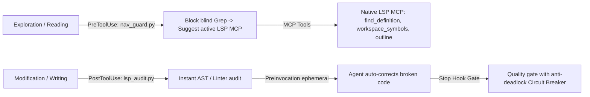

# Antigravity LSP Enforcement Kit

> A 360-degree Closed-Loop LSP Lifecycle & Quality Gate for Antigravity CLI
> Enforce LSP-first navigation to save up to 80% tokens & prevent broken code from landing.

[](https://github.com/dbqp01/LSP-Antigravity/actions)
[](LICENSE)
[](https://antigravity.dev)
[](plugin/lsp-enforcement-kit/lsp_audit.py)

---

## 1. The Problem

Without semantic LSP guidance, AI coding agents suffer from two critical inefficiencies:

1. Blind Exploration (Token Waste): The agent searches symbols via full-workspace grep_search and reads entire files, consuming 5,000-10,000+ tokens per lookup.
2. Blind Modification (Broken Code): The agent edits code without immediate syntax or type validation, finishing tasks with unresolved compilation errors.

---

## 2. The Solution: 360-degree LSP Lifecycle & Native MCP Server



### Native Built-in MCP Tools (Stdio JSON-RPC 2.0):
* `find_definition(filepath, line, character)`: Locates exact file and line of a symbol using the active language server.
* `find_references(filepath, line, character)`: Finds all call sites and usages across the workspace.
* `search_workspace_symbols(query)`: High-speed workspace-wide symbol search across all active indexers.
* `get_document_outline(filepath)`: Returns token-efficient hierarchical AST outline of any file.
* `get_diagnostics(filepath)`: Fetches real-time compiler and type-checker diagnostics.

### Supported Languages & Auto-Provisioned Servers:
* **Astro** (`.astro`): `@astrojs/language-server` + Frontmatter validation + `@astrojs/check`.
* **TypeScript / JavaScript** (`.ts`, `.tsx`, `.js`, `.jsx`, `.mjs`, `.cjs`): `typescript-language-server` + `node --check` + `biome` + `tsc`.
* **Python** (`.py`): `pyright` / `basedpyright` + Native AST + `symtable` + `ruff`.
* **Rust** (`.rs`): `rust-analyzer` + `cargo check --message-format=json`.
* **Go** (`.go`): `gopls` + `go vet`.
* **PHP** (`.php`): `intelephense` + `php -l`.
* **Bash / Shell** (`.sh`, `.bash`, `.zsh`): `bash-language-server` + `bash -n` / `sh -n`.
* **JSON / TOML / YAML** (`.json`, `.toml`): Native standard library parsers.

---

## 3. Quick 1-Click Installation

### Windows (PowerShell / CMD)
```powershell
# PowerShell
.\install.ps1

# CMD (or double-click)
install.cmd
```

### Linux & macOS (Bash)
```bash
chmod +x install.sh
./install.sh
```

---

## 4. Diagnostic Status Check

Verify installed compilers, linters, and session cache state at any time:

```bash
python plugin/lsp-enforcement-kit/lsp_audit.py status
```

---

## 5. Testing & Reproducibility

### Run the Native Test Suite
```bash
python -m unittest discover tests -v
```

### Run Stress & Benchmarking Suite
```bash
python tests/stress_test_suite.py
```

### Run in Docker Sandbox
```bash
docker compose -f docker/docker-compose.yml run --rm audit-sandbox
```

---

## 6. Acknowledgments & Upstream Attribution

This project is directly adapted and ported for Google Antigravity from the original [claude-code-lsp-enforcement-kit](https://github.com/nesaminua/claude-code-lsp-enforcement-kit) by [@nesaminua](https://github.com/nesaminua), licensed under the MIT License. We gratefully acknowledge their original architecture for LSP enforcement and token-saving navigation guards.

---

## 7. License

MIT License. See [LICENSE](LICENSE) for details. Built for efficiency: minimal code, fast execution, zero external dependencies, and 100% ASCII standard output compliance.
