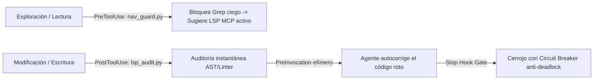

# 🚀 Antigravity LSP Enforcement Kit

> **A 360° Closed-Loop LSP Lifecycle & Quality Gate for Antigravity CLI**  
> *Enforce LSP-first navigation to save up to 80% tokens & prevent broken code from landing.*

[](https://github.com/your-username/antigravity-lsp-enforcement-kit/actions)
[](LICENSE)
[](https://antigravity.dev)
[](plugin/lsp-enforcement-kit/lsp_audit.py)

---

## 🎯 The Problem

Without semantic LSP guidance, AI coding agents suffer from two critical inefficiencies:

1. **Blind Exploration (Token Waste)**: The agent searches symbols via full-workspace `grep_search` and reads entire files, consuming 5,000–10,000+ tokens per lookup.
2. **Blind Modification (Broken Code)**: The agent edits code without immediate syntax or type validation, finishing tasks with unresolved compilation errors.

---

## ⚡ The Solution: 360° LSP Lifecycle



### 1. Pre-Tool Navigation Guard (`nav_guard.py`)
Intercepts `grep_search` and `find_by_name`. If a query contains code symbols (e.g., `UserService`, `handleSubmit`, `write_audit_log`), it **denies execution** and instructs the agent to use active LSP MCP tools (`serena`, `cclsp`) or targeted reading.

### 2. Post-Tool Incremental Auditor (`lsp_audit.py`)
Intercepts `write_to_file` and `replace_file_content`. Audits only modified files using a multi-tiered failover ladder:
* **Python**: AST parsing (0ms) $\to$ Ruff $\to$ Pyright.
* **TypeScript / JS**: Node `--check` $\to$ Biome $\to$ TSC.
* **Astro**: Frontmatter format check $\to$ `@astrojs/check`.
* **Rust**: `cargo check --message-format=json`.
* **Go**: `go vet`.
* **JSON / TOML**: Native stdlib parsers.

### 3. Cross-File Reconciliation
When a modified file passes cleanly, the auditor automatically re-validates remaining broken files in the session cache to clear resolved import/export errors.

### 4. Ephemeral Ingestion (`PreInvocation`)
Injects diagnostics into the model prompt via `ephemeralMessage`. The model fixes the error without cluttering the permanent conversation transcript.

### 5. Quality Gate with Circuit Breaker (`Stop`)
Prevents the agent from stopping while unresolved errors persist in cache. Automatically releases after **3 attempts** (*Circuit Breaker*) to prevent infinite deadlocks.

---

## 📦 Quick Installation

### Option A: Install as an Antigravity Global Plugin (Recommended)
Copy the plugin folder to your global Antigravity configuration directory:

```bash
# Linux / macOS
cp -r plugin/lsp-enforcement-kit ~/.gemini/config/plugins/

# Windows (PowerShell)
Copy-Item -Recurse -Force plugin/lsp-enforcement-kit "$env:USERPROFILE\.gemini\config\plugins\"
```

Enable the plugin inside Antigravity:
```text
/plugin enable lsp-enforcement-kit
```

### Option B: Project-Level Usage
Simply place the plugin inside your project root:
```bash
mkdir -p .agents/plugins/
cp -r plugin/lsp-enforcement-kit .agents/plugins/
```

---

## 🔍 Diagnostic Status Check

Verify installed compilers, linters, and session cache state at any time:

```bash
python plugin/lsp-enforcement-kit/lsp_audit.py status
```

---

## 🧪 Testing and Reproducibility

### Run the Native Test Suite (0 dependencies)
```bash
python -m unittest discover tests -v
```

### Run in Docker Sandbox
```bash
docker compose -f docker/docker-compose.yml run --rm audit-sandbox
```

---

## 📊 Token Savings Benchmark

| Task | Standard Grep + Read | LSP Enforced | Savings |
| :--- | :--- | :--- | :--- |
| Find symbol definition | ~6,500 tokens (Grep + 2 file reads) | ~580 tokens (`find_definition` + targeted read) | **~91%** |
| Find symbol usages | ~1,500 tokens (Noisy Grep matches) | ~150 tokens (`find_references`) | **~90%** |
| Syntax verification | Manual developer debugging | 0 tokens overhead (auto-fixed in-loop) | **100% automated** |

---

## 📜 License

MIT License. Designed with **Ponytail (ULTRA)** principles: minimal code, maximum speed, zero external dependencies.
