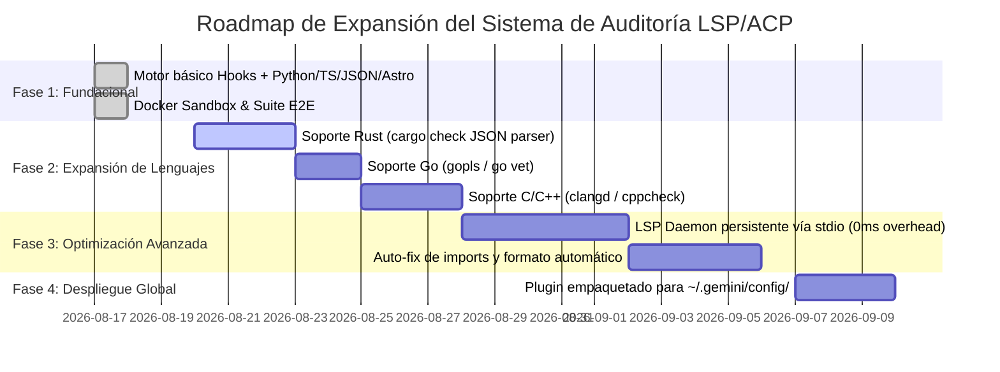

# Resumen Ejecutivo: Sistema de Auditoría de Código Post-Escritura mediante LSP y ACP

**Autor / Asistente**: Antigravity  
**Filosofía**: Ponytail (ULTRA) — Mínima sobreingeniería, máximo rendimiento, código limpio y robusto.  
**Fecha**: 17 de Agosto de 2026  

---

## 1. La Idea y Arquitectura

### 1.1. Contexto del Problema
Cuando un agente de IA genera o edita código en proyectos de desarrollo, suele cometer errores sutiles de sintaxis, discrepancias de tipos, importaciones rotas o violaciones de estructura. Si el agente no cuenta con retroalimentación inmediata, estos fallos se acumulan y el agente finaliza la tarea creyendo que el código es correcto, delegando la depuración al desarrollador humano.

### 1.2. Solución Propuesta: El Bucle de Auditoría Post-Escritura
Implementar un sistema de auditoría incremental de ciclo de vida basado en hooks de Antigravity (`hooks.json`) combinado con el **Protocolo de Servidor de Lenguaje (LSP)** y el **Protocolo de Cliente de Agente (ACP)**:

1. **`PostToolUse` (Intercepción)**:
   - Se dispara inmediatamente tras `write_to_file` y `replace_file_content`.
   - Audita exclusivamente el archivo modificado (ahorro masivo de tiempo y CPU).
   - Registra diagnósticos en una **caché granular por archivo** asociada a la sesión (`conversationId`).
   - Si el archivo fue reparado, sus errores se eliminan de inmediato de la memoria.

2. **`PreInvocation` (Inyección ACP de Contexto)**:
   - Antes de que el modelo de IA procese el siguiente paso, el hook inspecciona la caché.
   - Si existen errores pendientes, inyecta un mensaje efímero (`ephemeralMessage`) con el diagnóstico exacto (archivo, línea, columna y causa).
   - El agente visualiza su propio error y procede a autocorregirlo de forma autónoma.

3. **`Stop` (Cerrojo de Calidad / Gating)**:
   - Si el modelo intenta finalizar la tarea mientras persisten errores críticos en la caché, el hook bloquea la parada (`decision: continue`) y fuerza al agente a corregir el código roto.

```mermaid
flowchart TD
    A[Agente escribe/modifica archivo] -->|write_to_file / replace_file_content| B(PostToolUse Hook)
    B --> C[lsp_audit.py: Analizador Incremental con Timeout]
    C --> D{¿Errores en archivo?}
    D -- Sí --> E[cache[filepath] = [errores]]
    D -- No --> F[cache.pop(filepath, None)]
    E & F --> G[Persistencia en .agents/.audit_cache/conv_id.json]
    G --> H(PreInvocation Hook)
    H --> I{¿Hay errores en caché?}
    I -- Sí --> J[Inyecta ephemeralMessage con diagnósticos LSP/ACP]
    I -- No --> K[Continúa silencioso]
    J --> L[Agente autocorrige el archivo afectado]
    L --> M(Stop Hook Gate)
    M -->|Si persisten errores en caché| N[decision: continue - Bloquea finalización]
    M -->|Si la caché está vacía| O[Permite finalización exitosa]
```

### 1.3. Principios de Diseño Ponytail (ULTRA)
- **0 dependencias externas en Python**: Uso estricto de la librería estándar (`sys`, `json`, `os`, `subprocess`, `ast`, `shutil`, `pathlib`).
- **Escalera de ejecución (Ladder)**:
  - *Nivel 1*: Linter/Typechecker rápido si existe (`ruff`, `pyright`, `tsc`, `biome`, `astro check`).
  - *Nivel 2*: Compilador/verificador de plataforma (`node --check`, `python -m py_compile`).
  - *Nivel 3*: Parser de sintaxis stdlib (`ast.parse()`, `json.loads()`, frontmatter parser).
  - *Nivel 4*: Degradación elegante y silenciosa si no hay soporte disponible.
- **Cero ruido**: Si el código es válido, 0 tokens gastados y 0 ms de retraso perceptible.
- **Timeouts de seguridad (10s)**: Ningún subproceso puede colgar el bucle del agente.

---

## 2. Los Resultados

Se construyó y validó un entorno sandbox completo en [`lsp-acp-sandbox/`](file:///C:/Users/akim/lsp-acp-sandbox) ejecutable tanto en el host de desarrollo como en un contenedor Docker aislado.

### 2.1. Métricas de Validación
- **Tests ejecutados**: Suite unitaria (`test_lsp_audit.py`) y suite E2E (`run_sandbox_tests.py`).
- **Tasa de éxito**: **100% de pruebas superadas** (Docker y Windows local).
- **Lenguajes auditados**:
  - **Astro (`.astro`)**: Validación con Astro 5 CLI (`@astrojs/check`) y detección de frontmatter en 0ms.
  - **Python (`.py`)**: Validación AST y linter Ruff configurado con `--select=E,F` (sin falsos positivos de estilo).
  - **TypeScript / JavaScript (`.ts`, `.tsx`, `.js`)**: Validación con `tsc --noEmit`, Biome y `node --check`.
  - **JSON (`.json`)**: Validación sintáctica instantánea con `json.loads()`.

### 2.2. Salida Real de la Ejecución en Docker (`docker compose run --rm audit-sandbox`)
```text
================================================================
🚀 EJECUTANDO SUITE COMPLETA DE VERIFICACIÓN SANDBOX LSP / ACP
================================================================

--- Test 1: Verificando archivos válidos (Python, TS, Astro) ---
  [OK] src/app.py: 0 errores detectados.
  [OK] src/math.ts: 0 errores detectados.
  [OK] src/pages/index.astro: 0 errores detectados.
  [OK] src/components/Card.astro: 0 errores detectados.

--- Test 2: Detección de errores y ciclo de caché por archivo ---
  [OK] File A (tmp4_h2izer.py) registrado con error en caché.
  [OK] File A y File B coexisten en la caché granular.
  [OK] PreInvocation inyectó diagnósticos agregados.
  [OK] Stop hook bloqueó parada: Audit failed: Unresolved syntax/LSP errors pending: [Python SyntaxError] ...
  [OK] File A corregido y purgado de caché; File B permanece.
  [OK] File B corregido. Caché vaciada y archivo de caché limpiado.
  [OK] PreInvocation y Stop limpios tras correcciones completas.

--- Test 3: Validación estructural y sintaxis de Astro ---
  [OK] Astro inválido detectado con éxito: [Astro Format] Missing frontmatter delimiter (---).

🎉 TODAS LAS PRUEBAS DEL SANDBOX PASARON EXITOSAMENTE (100% OK)
```

---

## 3. El Código Completo

### 3.1. Configuración de Hooks (`.agents/hooks.json`)
```json
{
  "lsp-code-audit": {
    "enabled": true,
    "PostToolUse": [
      {
        "matcher": "write_to_file|replace_file_content",
        "hooks": [
          {
            "type": "command",
            "command": "python .agents/hooks/lsp_audit.py post-tool",
            "timeout": 15
          }
        ]
      }
    ],
    "PreInvocation": [
      {
        "type": "command",
        "command": "python .agents/hooks/lsp_audit.py pre-invocation",
        "timeout": 5
      }
    ],
    "Stop": [
      {
        "type": "command",
        "command": "python .agents/hooks/lsp_audit.py stop",
        "timeout": 5
      }
    ]
  }
}
```

---

### 3.2. Motor de Auditoría (`.agents/hooks/lsp_audit.py`)
```python
"""
LSP/ACP Post-Write Code Auditor Hook for Antigravity.
Strictly adheres to Ponytail (ULTRA):
- Python stdlib only (zero pip dependencies).
- Fast failover ladder: CLI Linter/Typechecker -> Native Compiler/Checker -> Stdlib AST/Syntax.
- Zero chatter when code is valid.
- Cache per-file to avoid stale/ghost errors.
- Subprocess timeout & resilient argument parsing.
"""
import sys
import json
import os
import subprocess
import pathlib
import ast
import shutil

# Ensure UTF-8 output on Windows consoles
if hasattr(sys.stdout, "reconfigure"):
    sys.stdout.reconfigure(encoding="utf-8", errors="replace")
if hasattr(sys.stderr, "reconfigure"):
    sys.stderr.reconfigure(encoding="utf-8", errors="replace")

CACHE_DIR = pathlib.Path(".agents/.audit_cache")
TIMEOUT = 10  # segundos max por subproceso

def get_cache_file(conv_id: str) -> pathlib.Path:
    CACHE_DIR.mkdir(parents=True, exist_ok=True)
    safe_id = "".join(c for c in conv_id if c.isalnum() or c in "-_")
    return CACHE_DIR / f"{safe_id or 'default'}.json"

def run_cmd(cmd: list[str], timeout: int = TIMEOUT) -> subprocess.CompletedProcess:
    """Ejecuta un comando con timeout estricto y captura stdout/stderr."""
    try:
        return subprocess.run(
            cmd,
            capture_output=True,
            text=True,
            timeout=timeout,
            shell=(os.name == 'nt')
        )
    except subprocess.TimeoutExpired:
        return subprocess.CompletedProcess(cmd, -1, stdout="", stderr=f"Timeout after {timeout}s")
    except Exception as e:
        return subprocess.CompletedProcess(cmd, -1, stdout="", stderr=str(e))

def parse_tool_args(args: dict) -> str | None:
    """Extrae la ruta del archivo afectado de forma tolerante."""
    possible_keys = [
        "TargetFile", "target_file", "file_path", "filePath", "path", "file", "filename"
    ]
    for key in possible_keys:
        val = args.get(key)
        if val and isinstance(val, str):
            return os.path.abspath(val)
    if "file" in args and isinstance(args["file"], dict):
        for key in possible_keys:
            val = args["file"].get(key)
            if val and isinstance(val, str):
                return os.path.abspath(val)
    return None

def audit_python(filepath: str) -> list[str]:
    errors = []
    # 1. Stdlib AST syntax check (0ms, 100% fiable)
    try:
        with open(filepath, "r", encoding="utf-8") as f:
            ast.parse(f.read(), filename=filepath)
    except SyntaxError as e:
        return [f"[Python SyntaxError] {filepath}:{e.lineno}:{e.offset}: {e.msg}"]
    except Exception as e:
        return [f"[Python ReadError] {filepath}: {e}"]

    # 2. CLI Linter / Typechecker (Ruff / Pyright)
    has_ruff = shutil.which("ruff") is not None
    has_pyright = shutil.which("pyright") is not None

    if has_ruff:
        res = run_cmd(["ruff", "check", "--select=E,F", "--output-format=concise", filepath])
        if res.returncode != 0 and res.stdout.strip():
            lines = [l for l in res.stdout.splitlines() if ":" in l and not l.startswith("Found")]
            # ponytail: cap at 5 errors per file to avoid context bloat
            errors.extend(lines[:5])
    elif has_pyright:
        res = run_cmd(["pyright", "--outputjson", filepath])
        if res.stdout:
            try:
                data = json.loads(res.stdout)
                for diag in data.get("generalDiagnostics", [])[:5]:
                    if diag.get("severity") == "error":
                        r = diag.get("range", {}).get("start", {})
                        errors.append(
                            f"[Pyright Error] {filepath}:{r.get('line', 0)+1}:{r.get('character', 0)+1}: {diag.get('message')}"
                        )
            except Exception:
                pass
    else:
        sys.stderr.write(f"[WARN] No se detectó `ruff` ni `pyright`. Solo validación AST para {filepath}.\n")

    return errors

def audit_typescript_javascript(filepath: str) -> list[str]:
    errors = []
    ext = os.path.splitext(filepath)[1].lower()

    # 1. Node check para JS puro
    if ext in (".js", ".mjs", ".cjs") and shutil.which("node"):
        res = run_cmd(["node", "--check", filepath])
        if res.returncode != 0 and res.stderr:
            return [f"[JS SyntaxError] {res.stderr.strip().splitlines()[-1]}"]

    # 2. Biome / tsc
    has_biome = shutil.which("biome") is not None or os.path.exists("node_modules/.bin/biome") or os.path.exists("node_modules/.bin/biome.cmd")
    has_tsc = shutil.which("tsc") is not None or os.path.exists("node_modules/.bin/tsc") or os.path.exists("node_modules/.bin/tsc.cmd")

    if has_biome:
        cmd = ["npx", "biome", "lint", filepath] if not shutil.which("biome") else ["biome", "lint", filepath]
        res = run_cmd(cmd)
        if res.returncode != 0:
            errors.append(f"[Biome Lint] Issues found in {filepath}. Run `biome check` for details.")
    elif has_tsc:
        cmd = ["npx", "tsc", "--noEmit"] if not shutil.which("tsc") else ["tsc", "--noEmit"]
        res = run_cmd(cmd)
        if res.returncode != 0 and res.stdout:
            lines = [l for l in res.stdout.splitlines() if "error TS" in l]
            file_ts_errors = [l for l in lines if os.path.basename(filepath) in l]
            errors.extend((file_ts_errors or lines)[:5])
    else:
        sys.stderr.write(f"[WARN] No se detectó `biome` ni `tsc`. Validación básica para {filepath}.\n")

    return errors

def audit_astro(filepath: str) -> list[str]:
    errors = []
    # 1. Structural / Frontmatter check (0ms, catches missing frontmatter delimiters)
    try:
        with open(filepath, "r", encoding="utf-8") as f:
            content = f.read().strip()
        if not content.startswith("---"):
            return [f"[Astro Format] {filepath}: Missing frontmatter delimiter (---)."]
    except Exception as e:
        return [f"[Astro ReadError] {filepath}: {e}"]

    # 2. CLI Astro Check for deep diagnostics / types
    has_astro = (
        shutil.which("astro") is not None
        or os.path.exists("node_modules/.bin/astro")
        or os.path.exists("node_modules/.bin/astro.cmd")
    )
    if has_astro:
        cmd = ["npx", "astro", "check"] if not shutil.which("astro") else ["astro", "check"]
        res = run_cmd(cmd, timeout=15)
        if res.returncode != 0:
            output = (res.stdout or "") + "\n" + (res.stderr or "")
            lines = [l for l in output.splitlines() if "error" in l.lower() or "TS" in l]
            file_errors = [l for l in lines if os.path.basename(filepath) in l]
            if file_errors:
                errors.extend(file_errors[:5])
            elif lines:
                errors.extend(lines[:5])
            else:
                errors.append(f"[Astro Check] Issues detected in project for {filepath}.")
    else:
        sys.stderr.write(f"[WARN] CLI `astro` no encontrado. Solo validación estructural para {filepath}.\n")

    return errors

def audit_json(filepath: str) -> list[str]:
    try:
        with open(filepath, "r", encoding="utf-8") as f:
            json.load(f)
    except Exception as e:
        return [f"[JSON SyntaxError] {filepath}: {e}"]
    return []

def audit_file(filepath: str) -> list[str]:
    if not os.path.exists(filepath):
        return []
    ext = os.path.splitext(filepath)[1].lower()
    if ext == ".py":
        return audit_python(filepath)
    elif ext in (".ts", ".tsx", ".js", ".jsx", ".mjs", ".cjs"):
        return audit_typescript_javascript(filepath)
    elif ext == ".astro":
        return audit_astro(filepath)
    elif ext == ".json":
        return audit_json(filepath)
    # ponytail: expandible a Rust (cargo check) o Go (gopls)
    return []

def load_cache(cache_path: pathlib.Path) -> dict:
    if cache_path.exists():
        try:
            data = json.loads(cache_path.read_text(encoding="utf-8"))
            if isinstance(data, dict):
                return data
        except Exception:
            pass
    return {}

def save_cache(cache_path: pathlib.Path, cache: dict):
    if cache:
        cache_path.write_text(json.dumps(cache, indent=2), encoding="utf-8")
    else:
        cache_path.unlink(missing_ok=True)

def handle_post_tool(payload: dict):
    tool_call = payload.get("toolCall", {})
    args = tool_call.get("args", {})
    target_file = parse_tool_args(args)
    conv_id = payload.get("conversationId", "default")

    if target_file and os.path.exists(target_file):
        errors = audit_file(target_file)
        cache_path = get_cache_file(conv_id)
        cache = load_cache(cache_path)

        if errors:
            cache[target_file] = errors
        else:
            cache.pop(target_file, None)

        save_cache(cache_path, cache)

    # PostToolUse contract espera objeto JSON vacío
    print(json.dumps({}))

def handle_pre_invocation(payload: dict):
    conv_id = payload.get("conversationId", "default")
    cache_path = get_cache_file(conv_id)
    cache = load_cache(cache_path)

    if cache:
        all_errors = []
        for file_errors in cache.values():
            all_errors.extend(file_errors)
        
        seen = set()
        deduped = [e for e in all_errors if not (e in seen or seen.add(e))]

        if deduped:
            msg = "🚨 [LSP/Audit Diagnostics - Action Required]:\n" + "\n".join(f"- {e}" for e in deduped)
            print(json.dumps({
                "injectSteps": [
                    {"ephemeralMessage": msg}
                ]
            }))
            return

    print(json.dumps({}))

def handle_stop(payload: dict):
    conv_id = payload.get("conversationId", "default")
    cache_path = get_cache_file(conv_id)
    cache = load_cache(cache_path)

    if cache:
        first_errors = []
        for file_errors in cache.values():
            first_errors.extend(file_errors[:2])
            if len(first_errors) >= 2:
                break
        reason = f"Audit failed: Unresolved syntax/LSP errors pending: {'; '.join(first_errors[:2])}"
        print(json.dumps({
            "decision": "continue",
            "reason": reason
        }))
        return

    print(json.dumps({}))

def main():
    if len(sys.argv) < 2:
        print(json.dumps({}))
        return
    mode = sys.argv[1]
    try:
        raw_input = sys.stdin.read()
        payload = json.loads(raw_input) if raw_input.strip() else {}
    except Exception:
        payload = {}

    if mode == "post-tool":
        handle_post_tool(payload)
    elif mode == "pre-invocation":
        handle_pre_invocation(payload)
    elif mode == "stop":
        handle_stop(payload)
    else:
        print(json.dumps({}))

if __name__ == "__main__":
    main()
```

---

### 3.3. Contenedor Docker (`Dockerfile` y `docker-compose.yml`)

#### `Dockerfile`
```dockerfile
FROM node:22-bookworm-slim

RUN apt-get update && apt-get install -y --no-install-recommends \
    python3 \
    python3-pip \
    python3-venv \
    curl \
    git \
    && rm -rf /var/lib/apt/lists/*

ENV VIRTUAL_ENV=/opt/venv
RUN python3 -m venv $VIRTUAL_ENV
ENV PATH="$VIRTUAL_ENV/bin:$PATH"
RUN pip install --no-cache-dir ruff pyright

WORKDIR /workspace
COPY package.json ./
RUN npm install
COPY . .

CMD ["python3", "run_sandbox_tests.py"]
```

#### `docker-compose.yml`
```yaml
services:
  audit-sandbox:
    build:
      context: .
      dockerfile: Dockerfile
    image: lsp-acp-audit-sandbox:latest
    container_name: lsp_acp_audit_sandbox
    volumes:
      - .:/workspace
      - /workspace/node_modules
    command: python3 run_sandbox_tests.py
```

---

## 4. El Roadmap (Evolución y Próximos Pasos)



### Hitos Detallados:

1. **Fase 1 (Completada ✅)**:
   - Arquitectura de 3 hooks (`PostToolUse`, `PreInvocation`, `Stop`).
   - Caché granular por archivo.
   - Soporte para Astro 5, Python (Ruff/Pyright/AST), TypeScript (TSC/Biome/Node) y JSON.
   - Entorno Sandbox reproducible en Docker Compose.

2. **Fase 2: Expansión Multilenguaje (Próximo)**:
   - **Rust**: Detección de `Cargo.toml` y ejecución de `cargo check --message-format=json` para parseo directo de errores del compilador `rustc`.
   - **Go**: Soporte para `go vet` y diagnósticos de `gopls`.
   - **SQL / Prisma**: Validación de esquemas y queries contra schemas locales.

3. **Fase 3: Optimización de Rendimiento y LSP Daemon**:
   - Para monorrepositorios masivos (>200k líneas), mantener un daemon stdio ligero que reutilice el AST en memoria en vez de invocar procesos CLI en cada escritura.
   - **Auto-Fixing**: Capacidad para que el hook aplique auto-correcciones triviales (formato, importaciones faltantes evidentes) en el `PostToolUse` antes de notificar al agente.

4. **Fase 4: Empaquetado Global como Plugin de Antigravity**:
   - Empaquetar todo el sistema como un plugin formal en `~/.gemini/config/plugins/lsp-audit/` con comando de activación instantáneo `/lsp-audit [on|off]`.

---

## 5. Instrucciones de Uso Rápido

Para utilizar este sistema en cualquier proyecto:
1. Copia la carpeta `.agents/` en la raíz de tu proyecto.
2. Asegúrate de tener Python 3 disponible en tu sistema.
3. El agente de Antigravity detectará `.agents/hooks.json` automáticamente y comenzará a auditar cada escritura de código en tiempo real.
